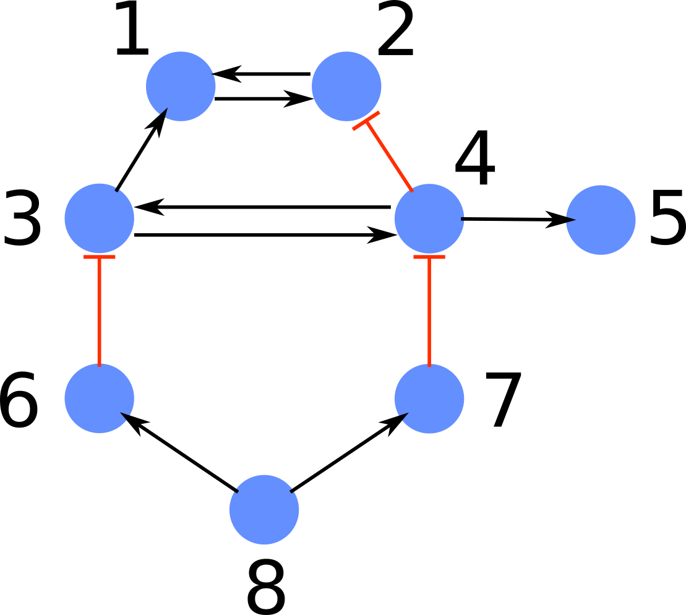

# Fibrations symmetries on Julia

Implementation in Julia for the fast fibration partitioning (FFP) algorithm on directed networks. The algorithm is presented 
in the paper of *Monteiro et. al.* (link for the draft to be available soon). In this paper we use the codes in this repo for
proper perfomance comparison between the FFP algorithm and other common methods for the identification of fibration symmetries.
Here, we give general guidance on how to obtain the fibration partitioning, or minimal balanced coloring, of any directed network
parsed through a CSV file.

Fibration symmetries in context of complex networks are introduced in the recent work of [Morone et. al.](https://www.pnas.org/content/117/15/8306).

## Importing

To use the julia package of name 'FastFibration' in the command line, it is necessary first to access the package command line
of julia (accessed via ']' in the julia REPL) and use the following command inside the `fast_fibration/` folder: 
```julia
pkg> activate .
julia> using FastFibration
```
The activate command above is not necessary if the package is used in jupyter notebooks.

## Usage 

To find the fibration partitioning of a given directed network it is necessary only the information of the network structure (nodes and edges)
and the types of each edge (in case the edges are multidimensional). For this, the network must be parsed as an **CSV file** following the structure
of an edgelist containing two essential informations (source and target) and one optional information (the type of the edge for multiplex scenarios). 
For instance, let us consider the graph below where the edges can assume two possible values: 'positive' or 'negative'.



The edgefile for this graph, called `net.csv` should follow the format below:

> Source,Target,Type<br/>
> 1,2,positive<br/>
> 2,1,positive<br/>
> 3,1,positive<br/>
> 3,4,positive<br/>
> 4,2,negative<br/>
> 4,3,positive<br/>
> 4,5,positive<br/>
> 6,3,negative<br/>
> 7,4,negative<br/>
> 8,6,positive<br/>
> 8,7,positive<br/>

In this file, the third column refers to the possible values of each edge. There is no restriction on the specific
format of its values as long as each different string represent a different edge type. For the first (source) and 
second (target) columns the node labels must be inside the interval \[1,N\] where N is the total number of nodes in
the graph.

Thus, to extract the fibers of the network provided by this edgefile, we run the 
following

```julia
    graph = FastFibration.graph_from_csv("path/to/edgefile", true)
    fiber_partition = FastFibration.fast_fibration(graph)
    number_nontrivial_fibers, total_fibers, fiber_map = FastFibration.extract_fiber_groups(fiber_partition)
```

Where `fiber_partition` is a container or array holding `Fiber` structures. To access the nodes belonging to a specific fiber, we can check `.nodes`, like in `fiber_partition[1].nodes` for the first element of the container returned. To get the information about the number of fibers, total number of partition 
elements and which nodes inside each `partition` element, we can use the results obtained from `extract_fiber_groups` function, which returns the number of fibers containing more than one node (nontrivial), the total number of fibers (including single node fibers) and a julia dictionary `fiber_map`. The dictionary 
`fiber_map` has as keys the indexes of `fiber_partition` and as values the array of node labels belonging to each fiber of `fiber_partition`.

## Tests

In the folder `fast_fibration/data/` there are 7 seven different networks which provides basic example networks to test the code. All these files represent 
simple circuits on which is easy to check the correctness of the algorithm, with exception the file `test_Ecoli.csv`, which represents the main dataset used
in the previous work of [Morone et. al.](https://www.pnas.org/content/117/15/8306).

## License

MIT License

Copyright (c) 2021 higorsmonteiro <higormonteiros@gmail.com> and contributors

Permission is hereby granted, free of charge, to any person obtaining a copy
of this software and associated documentation files (the "Software"), to deal
in the Software without restriction, including without limitation the rights
to use, copy, modify, merge, publish, distribute, sublicense, and/or sell
copies of the Software, and to permit persons to whom the Software is
furnished to do so, subject to the following conditions:

The above copyright notice and this permission notice shall be included in all
copies or substantial portions of the Software.

THE SOFTWARE IS PROVIDED "AS IS", WITHOUT WARRANTY OF ANY KIND, EXPRESS OR
IMPLIED, INCLUDING BUT NOT LIMITED TO THE WARRANTIES OF MERCHANTABILITY,
FITNESS FOR A PARTICULAR PURPOSE AND NONINFRINGEMENT. IN NO EVENT SHALL THE
AUTHORS OR COPYRIGHT HOLDERS BE LIABLE FOR ANY CLAIM, DAMAGES OR OTHER
LIABILITY, WHETHER IN AN ACTION OF CONTRACT, TORT OR OTHERWISE, ARISING FROM,
OUT OF OR IN CONNECTION WITH THE SOFTWARE OR THE USE OR OTHER DEALINGS IN THE
SOFTWARE.


